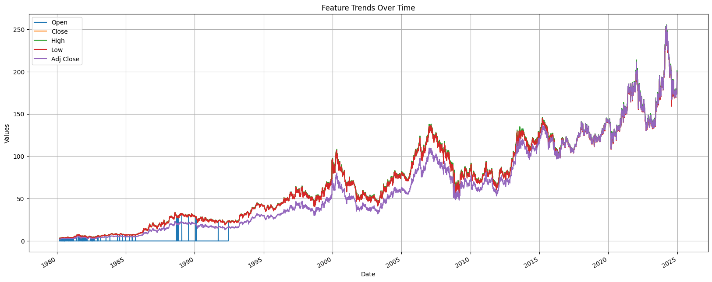
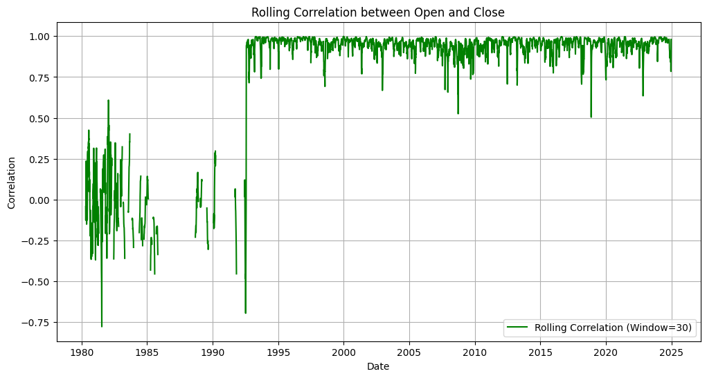
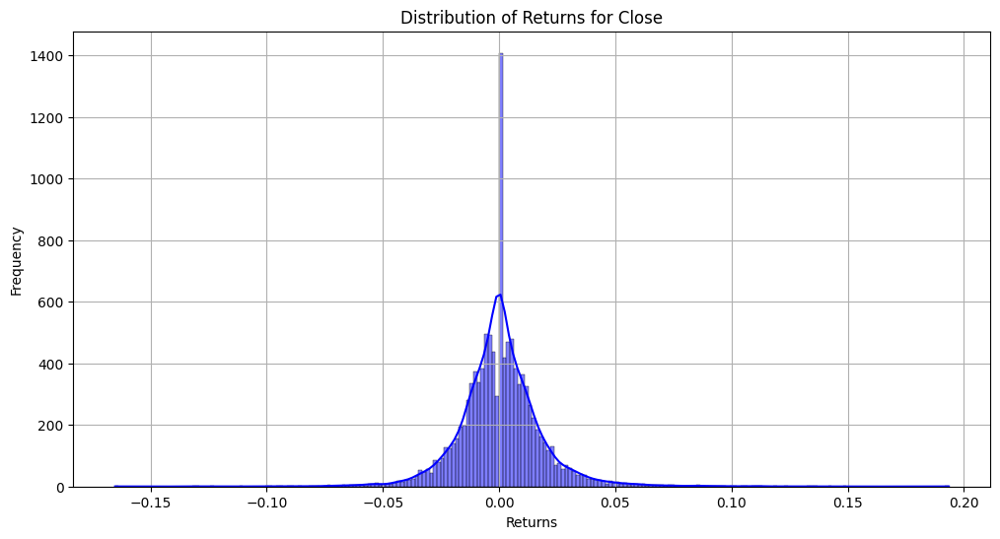
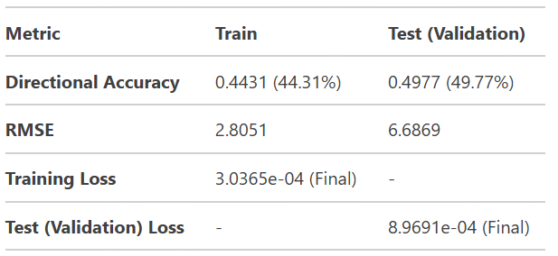
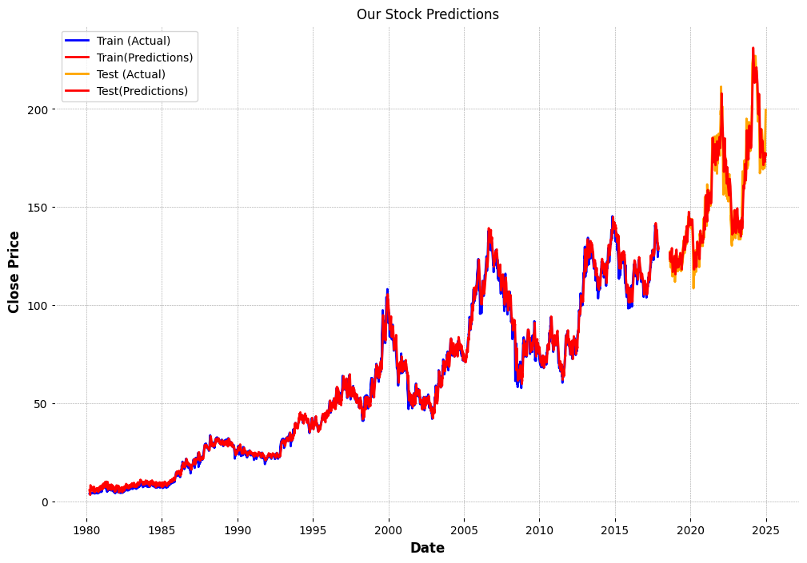
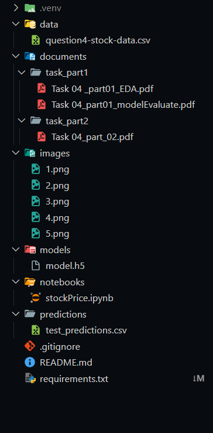

# Stock Price Prediction Using LSTM - Intellihack_Cognic_AI_04

This project focuses on predicting stock prices using a **Long Short-Term Memory (LSTM)** model. The goal is to forecast the closing price of a stock 5 trading days into the future. Below is a summary of the approach, key findings, and instructions to reproduce the results.

---

## Table of Contents

1. [Approach](#1-approach)
   - [Data Preparation](#11-data-preparation)
   - [Model Architecture](#12-model-architecture)
   - [Training](#13-training)
   - [Evaluation](#14-evaluation)
2. [Key Findings](#2-key-findings)
3. [Instructions to Reproduce Results](#3-instructions-to-reproduce-results)
   - [Prerequisites](#31-prerequisites)
   - [Steps to Reproduce](#32-steps-to-reproduce)
   - [File Structure](#33-file-structure)
4. [Conclusion](#4-Conclusion)

---

## 1. Approach

### 1.1 Data Preparation

- **Dataset**: Historical stock price data from 1980 to 2025, including `Date`, `Open`, `High`, `Low`, `Close`, and `Volume`.

    

- **Preprocessing**:
  - Converted the `Date` column to datetime format and set it as the index.
  - Calculated daily returns and rolling statistics for feature engineering.
- **EDA**

  - Conducted an in-depth analysis of the dataset to identify key patterns, trends, and insights.

  

  - Gained a comprehensive understanding of the data structure, relationships, and distribution through statistical analysis and visualization techniques.

  

### 1.2 Model Architecture

- **Model**: A sequential LSTM model with the following layers:
  - Two LSTM layers with 128 units each.
  - A dense layer with 256 units and ReLU activation.
  - A dropout layer with a rate of 0.12 to prevent overfitting.
  - A dense output layer with 1 unit for regression.
- **Loss Function**: Mean Squared Error (MSE) to measure prediction accuracy.

- **Optimizer**: Adam optimizer with a learning rate of 0.006.

### 1.3 Training

- **Epochs**: Trained for 20 epochs with early stopping based on validation loss.
- **Batch Size**: 32.
- **Validation Data**: Used a portion of the training data (15%) for validation.

### 1.4 Evaluation

- **Metrics**:
  - **RMSE (Root Mean Squared Error)**: Measures the average magnitude of prediction errors.
  - **Directional Accuracy**: Measures the percentage of correct directional predictions (up or down).
- **Results**:

    
    
    <br />

  - **Training RMSE**: 2.8051
  - **Test RMSE**: 6.6869
  - **Training Directional Accuracy**: 44.31%
  - **Test Directional Accuracy**: 49.77%

    <br />

  

---

## 2. Key Findings

1. **Strong Training Performance**

   - The model demonstrates high accuracy on the training data, indicating that it effectively learns from historical price patterns.

2. **Potential for Improvement**

   - While the test directional accuracy is **49.77%**, the model provides a solid baseline for further enhancement through feature engineering and hyperparameter tuning.

3. **Feature Engineering**:
   - The model relies solely on historical price data. Incorporating additional features such as technical indicators, news sentiment, and economic data could improve performance.

---

## 3. Instructions to Reproduce Results

### 3.1 Prerequisites

- **Python Version**: 3.8 or higher.
- **Libraries**:
  - Install the required libraries using the following command:
    ```bash
    pip install -r requirements.txt
    ```

### 3.2 Steps to Reproduce

1. **Clone the Repository**:

   ```bash
   git clone https://github.com/Cognic-AI/Intellihack_Cognic_AI_04.git

   cd INTELIHACK_COGNIC_AI_04
   ```

2. **Prepare the Data**

3. **Train Model with Data**

4. **Evaluate and Validate the Results**

### 3.3 File Structure



---

## 4. Conclusion

This project demonstrates the potential of LSTM models for stock price prediction. While the model shows promising performance on the training data, there is room for improvement in generalizing to unseen data. By addressing limitations such as overfitting and incorporating additional features, we can build a more robust and accurate stock price prediction system.

For questions or feedback, please contact [COGNIC AI](mailto:anjanapraneeth7@gmail.com).
